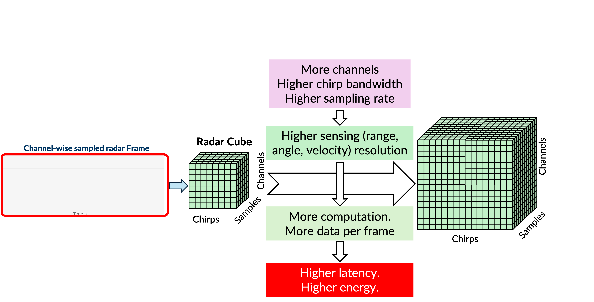
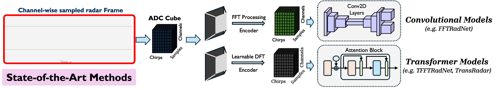
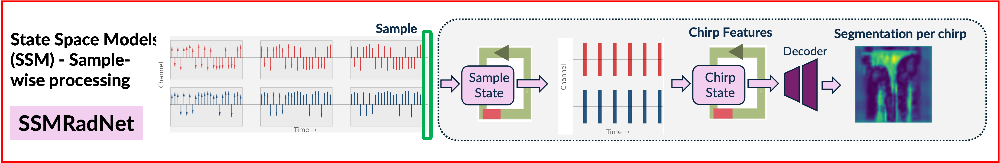
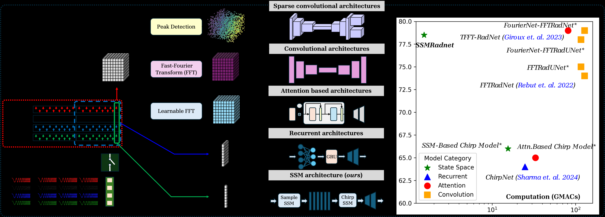
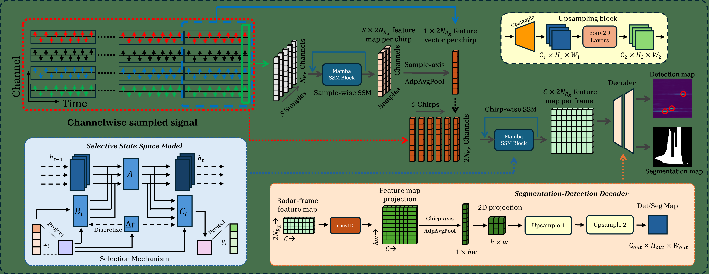
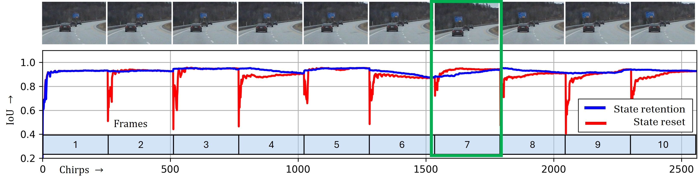

# SSMRadNet: A Sample-wise State-Space Framework for Efficient and Ultra-Light Radar Object Detection

[](https://arxiv.org/abs/2511.08769)
[](https://openaccess.thecvf.com/content/WACV2026/papers/Sen_SSMRadNet__A_Sample-wise_State-Space_Framework_for_Efficient_and_Ultra-Light_WACV_2026_paper.pdf)

This package contains an upload-ready README plus visualization assets for the **WACV 2026 Oral** paper:
**SSMRadNet: A Sample-wise State-Space Framework for Efficient and Ultra-Light Radar Segmentation and Object Detection**.

SSMRadNet is the first multi-scale State Space Model (SSM) based detector for FMCW radar that sequentially processes raw ADC samples. It achieves **10-33x fewer parameters** and **60-88x lower GFLOPs** compared to state-of-the-art transformer and convolution-based radar detectors.

---

## Background and Motivation

### The Scaling Problem in Radar Perception
As radar systems increase channels, chirps, and sampling rates, Radar Data Cubes grow rapidly and create major compute/latency bottlenecks.



### Limitations of Prior Methods
Most prior methods use convolutional or transformer pipelines with FFT/Learnable-DFT pre-processing, which adds computational and memory overhead.



### SSMRadNet
SSMRadNet introduces sample-wise raw ADC processing using dual SSM pathways (chirp-wise and frame-wise) to build multi-scale features efficiently while keeping segmentation/detection performance strong.



---

## Paper Screenshots and OCR Visualizations

The following screenshots were extracted from `ssmradnet.pdf`, and OCR text was generated with `tesseract` for quick content indexing.

### Extracted Visuals
- Compute vs Performance: `paper_extract/compute-vs-performance.png`
- Architecture Overview: `paper_extract/architecture-overview.png`
- Qualitative Results: `paper_extract/qualitative-examples.png`
- State Retention View: `paper_extract/state-retention.png`
- Full Paper Screenshot (Page 2): `paper_extract/paper-page-02-screenshot.png`

### OCR Text Files
- `paper_extract/compute-vs-performance.ocr.txt`
- `paper_extract/architecture-overview.ocr.txt`
- `paper_extract/qualitative-examples.ocr.txt`
- `paper_extract/state-retention.ocr.txt`
- `paper_extract/paper-page-01.ocr.txt`
- `paper_extract/paper-page-02.ocr.txt`
- `paper_extract/paper-page-03.ocr.txt`

Preview:





---

## News

- **[2025-11-11]** Accepted as an **Oral Presentation at WACV 2026**
- **[2025-11-08]** arXiv version released: https://arxiv.org/abs/2511.08769

## TODO

- [x] Release the arXiv version
- [ ] Release code for **RaDICaL** and **RADIal** datasets
- [ ] Release the **RaDICaL** data (including labels)
- [ ] Clean up and release training/inference code
- [ ] Release visualization scripts for radar ADC sample processing

## Acknowledgments

SSMRadNet builds on Mamba and is inspired by RADIal and RaDICaL benchmarks. Thanks to all prior open-source radar perception efforts.

## Citation

```bibtex
@inproceedings{sen2026ssmradnet,
  title={SSMRadNet: A Sample-wise State-Space Framework for Efficient and Ultra-Light Radar Segmentation and Object Detection},
  author={Sen, Anuvab and others},
  booktitle={Proceedings of the IEEE/CVF Winter Conference on Applications of Computer Vision (WACV)},
  year={2026}
}
```
